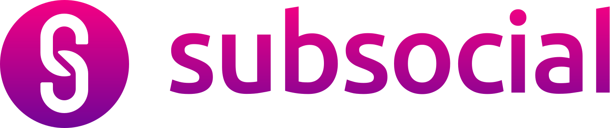

  
  <h1 align="center">Awesome Apps Built on Subsocial</h1>
  

    
        
    
  

## Awesome Apps Built on Subsocial

Subsocial is a Substrate-based blockchain that allows anyone to launch their own decentralized censorship-resistant social network. The Subsocial SDK is a set of developments tools (methods, functions, and so on) that allows you to create your own social network on Subsocial.

If you want to build a new Dapp, check out the following links:
- [Documentation](https://docs.subsocial.network)
- [SDK Playground](https://play.subsocial.network)
- [Developer QuickStart Guide](https://docs.subsocial.network/docs/develop/developer-quickstart)
- [Subsocial JS SDK](https://github.com/dappforce/subsocial-js)

For Dev Support:
- [Developers Chat](https://t.me/+ZzvLu0ZfkQwxNGQy)
- [Stack Exchange](https://substrate.stackexchange.com/questions/tagged/subsocial)

The following is a list of awesome apps built on top of the Subsocial protocol. 

### Contents

#### Social Networks
- [Grill.chat](#grillchat)
- [Frentube](#frentube)
- [SubDot](#subdot)
- [Quereers](#quereers)
- [Substrate Stack Exchange](#substrate-stack-exchange)
- [PAX](#pax)
- [Polkadot Arena Blog](#polkadot-arena-blog)
- [Polkaverse](#polkaverse)

#### Social Protocols
- [AmazingGreen](#amazinggreen)
- [AdMeta](#admeta)
- [SOS Help App](#sos-help-app)

#### Tools
- [Sub.ID](#subid)
- [Subsocial Ghost - A Gatsby Plugin](#subsocial-ghost---a-gatsby-plugin)
- [Subtwit](#subtwit)
- [ComposeR](#composer)
- [Post4Ever](#post4ever)

#### Partnerships
- [AirLyft](#airlyft)

#### Examples
- [Twitter Dapp](#twitter-dapp)

## Social Networks

### [Grill.chat](https://grill.chat/)
Chat anonymously on-chain without needing a crypto wallet, utilizing our censorship-resistant blockchain and app with anonymous logins.

Source Code: [GitHub](https://github.com/dappforce/grillchat)

Built by: The Subsocial Team

### [FrenTube](https://poltube.vercel.app)
A decentralized video-sharing platform that values privacy and content ownership.

Source Code: [GitHub](https://github.com/abdul-kabugu/poltube)

Built by: [Abdul Kabugu](https://github.com/abdul-kabugu)

### [SubDot](https://subdot.netlify.app)
Subdot is a decentralized social media platform powered by substrate and Subsocial that provides users with complete control over their data and content. 
By removing a central authority, the platform allows users to participate in decision-making, governance, and possibly receive rewards for their contributions. 
It provides a reputation & ranking feature based on your engagement over the social network.

Source Code: [GitHub](https://github.com/its-me-sv/subdot-frontend)

Built by: [Suraj Vijay](https://github.com/its-me-sv)

### [Quereers](https://quereers.netlify.app/)
Quereers is inspired by social platforms like Quora, WikiHow, and Stack Exchange, and was also partly influenced by the Subsocial track challenges 
in the Polkadot Europe Hackathon. Quereers is from the word Query and it is a social platform where users get rewarded for sharing their knowledge.

Source Code: [GitHub](https://github.com/bolajahmad/quereers)

Built by: [Bolaji Ahmad](https://github.com/bolajahmad)

### [Substrate Stack Exchange](https://substrate-stackexchange.vercel.app)
A decentralized forum for developer Q&As regarding substrate development, built on top of Subsocial.

Source Code: [GitHub](https://github.com/teodorus-nathaniel/substrate-stackexchange)

Built by: [Teodorus Nathaniel Kurniawan](https://github.com/teodorus-nathaniel)

### [PAX](https://pax.vercel.app)
A decentralized version of Instagram built for creators.

Source Code: [GitHub](https://github.com/abdul-kabugu/subsocial-react-example)

Built by: [Abdul Kabugu](https://github.com/abdul-kabugu)

### [Polkadot Arena Blog](https://www.polkadotarena.blog)
Polkadot Arena is an Italian-focused news site for the Polkadot and Kusama ecosystem that pulls its content from Subsocial's content base.

Source Code: [GitHub](https://github.com/MarcooRo/polkadot-arena-blog)

Built by: [Marco](https://github.com/MarcooRo)

### [Polkaverse](https://www.polkaverse.com)
The #1 decentralized social network in the Polkadot and Kusama ecosystem, created by the Subsocial team as a reference implementation for the Subsocial protocol. 
Build and own your Web3 network and keep up to date with the latest news from the ecosystem today!

Source Code: [GitHub](https://github.com/dappforce/polkaverse)

Built by: The Subsocial Team

## Social Protocols

### [AmazingGreen](https://amazing-green-polkadot.vercel.app/)
AmazingGreen is a platform that empowers your community to take more control over the issues that affect them. 
Join AmazingGreen and read about the goals for your community, and the funds that are available to reach these goals. 
You can add your own ideas or even vote on the ideas of your neighbors. The most popular solutions will be implemented, benefitting the whole community. 
AmazingGreen gives everybody a vote and a voice.

AmazingGreen uses Subsocial for social & communication features in order to enable good engagement and planning.

Source Code: [GitHub](https://github.com/457ksnider/AmazingGreen)

Built by: [457ksnider](https://github.com/457ksnider)

### [AdMeta](https://testapp.subsocial.admeta.network/)
AdMeta is a Web3 advertising protocol, completely designed and customized for Web3. 
It easily enables content monetization on Subsocial.

Source Code: [GitHub](https://github.com/AdMetaNetwork/subsocial-admeta-integration)

Built by: [Han Zhao](https://github.com/h4n0)

### [SOS Help App](https://polkadot-hackathon-eywzsv6n9-mashrin.vercel.app/)
This app can help find essential resources during any disaster using the posts made by the social media users.

Source Code: [GitHub](https://github.com/mashrin/polkadot-hackathon)

Built by: [Mashrin Srivastava](https://github.com/mashrin), Maansi Srivastava

## Tools

### [Sub.ID](https://sub.id)
The #1 portfolio management tool in the Polkadot ecosystem. See your balances, crowdloan history, NFTs, and more. Claim vested tokens and perform transfers.

Source Code: [GitHub](https://github.com/dappforce/subid)

Built By: The Subsocial Team

### [Subsocial Ghost - A Gatsby Plugin](https://github.com/huascarmm/subsocial-gatsby-example)
Subsocial Ghost is a Gatsby plugin that allows people to backup their articles on the Subsocial network very easily by setting up a simple config file in the project.

Source Code: [GitHub](https://github.com/huascarmm/subsocial-gatsby-example)

Built by: [Huascarm](https://github.com/huascarmm)

### [SubTwit](https://sub-twit.vercel.app/)
SubTwit is a backend service that runs continously to back up a list of selected creators' tweets onto the Subsocial blockchain.

Source Code: [BitBucket](https://bitbucket.org/archsharma655/sub-twit-server/src/main/)

Built by: [Archi Sharma](https://bitbucket.org/archsharma655/)

### [ComposeR](https://www.youtube.com/watch?v=Y3zLnur7mUU)
Cross posting tweets to Subsocial based on a URL.

Built by: Gratiam

### [Post4Ever](https://post4ever.app/)
Back up your Twitter content using Subsocial, a decentralized Web3 social networking platform. Take ownership of your tweets by putting them on the blockchain.

Source Code: [GitHub](https://github.com/dappforce/post4ever)

Built by: The Subsocial Team

## Partnerships / Integrations

### [AirLyft](https://airlyft.one)
AirLyft is the first ever multichain decentralized growth hacking platform that helps you build, scale, and engage with your community in a legitimate manner. 

Source Code: [GitHub](https://github.com/Kyte-Research/)

Built by: [Chandra Bhushan Singh](https://github.com/huascarmm)

## Examples

### [Twitter Dapp](https://www.youtube.com/watch?v=jeTrpltqAqc&list=LL&index=187)
A decentralized Twitter app built in 50 minutes during a webinar.

Source Code: [GitHub](https://github.com/dappforce/twitter-example)

Built by: The Subsocial Team

### Contributing
If you believe you have built something awesome on top of Subsocial, feel free to create a PR to add it to the list.

